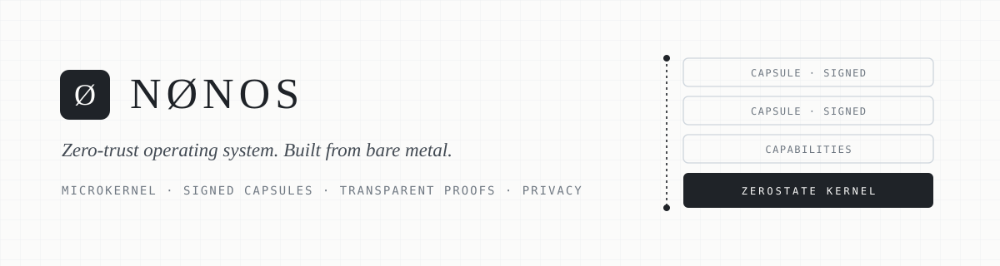
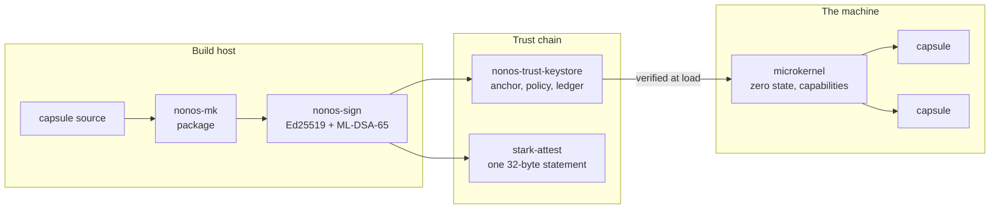
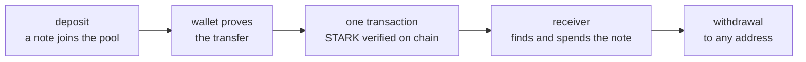

<picture>
  <source media="(prefers-color-scheme: dark)" srcset="assets/banner-dark.svg">
  
</picture>

 

**NØNOS** is an operating system built from bare metal around one idea: a machine should trust as
little as possible and remember as little as it needs. The kernel starts from zero state, runs in
memory, and loads only software whose signature it can check. Every privilege is a capability
granted on purpose, not something a process inherits by accident.

The same idea runs through the rest of the stack. **The NØNOS STARK** is a transparent proof
system written from scratch: Goldilocks, FRI, Poseidon and Keccak, with no trusted setup and no
pairings. **NØNOS Shield** uses it to move value privately on Ethereum. A transfer is one
transaction, and inside it the chain verifies the whole proof and recomputes every constraint
itself.

 

## How it fits together

 

## Principles

**Zero state.** The system runs from memory and forgets on shutdown. Nothing persists unless it is
asked to.

**Capabilities, not ambient authority.** A process can do only what it has been handed an explicit
right to do.

**Everything signed.** Capsules carry a hybrid signature, classical and post-quantum. The kernel
checks it against a sealed trust anchor before a single instruction runs.

**Proofs over promises.** Where a claim can be checked by a machine, it is: by a signature, by a
transparent proof, or by a test that fails when the property breaks.

 

## NØNOS Shield

Private transfers on Ethereum L1, verified by a STARK in a single transaction.

<table>
  <tr>
    <td align="center" width="25%"><b>1 transaction</b> per private transfer, with the whole proof verified on chain</td>
    <td align="center" width="25%"><b>0 trusted setups</b> no ceremony, no pairings, no off-chain verifier</td>
    <td align="center" width="25%"><b>Every constraint</b> recomputed by the chain, not supplied by the prover</td>
    <td align="center" width="25%"><b>Sepolia</b> first end-to-end private transfers settled, in ETH and NOX</td>
  </tr>
</table>

Blinded proofs, proving on your own device and an external audit come before mainnet.

 

## Repositories

<table>
  <tr>
    <th align="left" width="28%">Kernel</th>
    <td>
      <a href="https://github.com/NON-OS/microkernel"><b>microkernel</b></a> The NØNOS microkernel, in Rust 
      <a href="https://github.com/NON-OS/nonos-docs"><b>nonos-docs</b></a> Kernel documentation 
      <a href="https://github.com/NON-OS/micro-kernel-only-tests"><b>micro-kernel-only-tests</b></a> Boot smoke harnesses and recorded results 
      <a href="https://github.com/NON-OS/nonos-ci"><b>nonos-ci</b></a> Static checks, baselines and trust-chain CI 
      <a href="https://github.com/NON-OS/VBox"><b>VBox</b></a> Run NØNOS in VirtualBox
    </td>
  </tr>
  <tr>
    <th align="left">Trust chain</th>
    <td>
      <a href="https://github.com/NON-OS/nonos-trust-keystore"><b>nonos-trust-keystore</b></a> Trust anchor, publisher keys, sealed policy, signed manifests and ledger 
      <a href="https://github.com/NON-OS/nonos-sign"><b>nonos-sign</b></a> Capsule signer and verifier, Ed25519 + ML-DSA-65 
      <a href="https://github.com/NON-OS/nonos-mk"><b>nonos-mk</b></a> Capsule packager and marketplace index 
      <a href="https://github.com/NON-OS/stark-attest"><b>stark-attest</b></a> Attest a set of artifacts with one 32-byte statement, transparently
    </td>
  </tr>
  <tr>
    <th align="left">Proofs</th>
    <td>
      <b>NØNOS STARK</b> The transparent prover and verifier: Goldilocks, FRI, DEEP, Poseidon. Opening at launch 
      <b>NØNOS Shield</b> The shielded pool and its on-chain STARK verifier. Opening at launch 
      <a href="https://github.com/NON-OS/zkolang"><b>zkolang</b></a> A verifiable-compute language, proven by the NØNOS transparent STARK
    </td>
  </tr>
  <tr>
    <th align="left">Apps and tools</th>
    <td>
      <a href="https://github.com/NON-OS/nonos.software"><b>nonos.software</b></a> Wiki, manual, ISO downloads and news 
      <a href="https://github.com/NON-OS/android-app"><b>android-app</b></a> · <a href="https://github.com/NON-OS/ios-app"><b>ios-app</b></a> · <a href="https://github.com/NON-OS/NOXDashboard"><b>NOXDashboard</b></a> · <a href="https://github.com/NON-OS/NOXtools"><b>NOXtools</b></a>
    </td>
  </tr>
</table>

 

  <a href="https://nonos.software"><b>nonos.software</b></a>
  &nbsp;·&nbsp;
  <a href="https://nonos.systems"><b>nonos.systems</b></a>
  &nbsp;·&nbsp;
  <a href="mailto:team@nonos.systems"><b>team@nonos.systems</b></a>

<i>Trust nothing you cannot verify. Keep nothing you do not need.</i>

